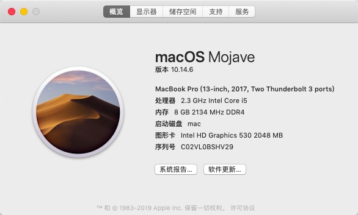
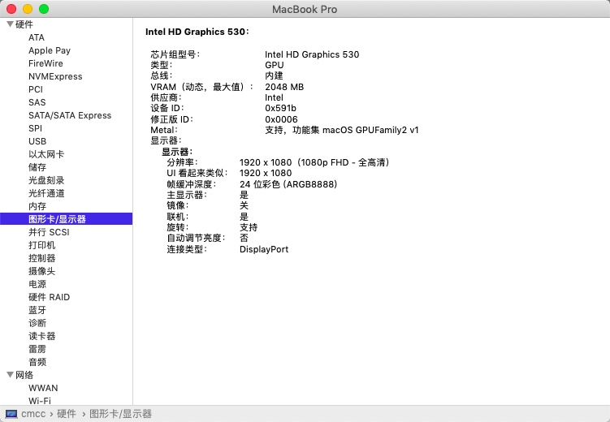
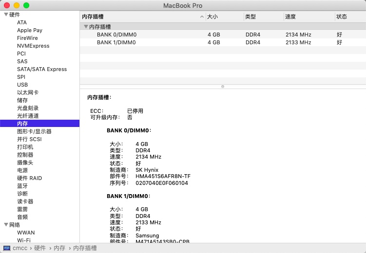
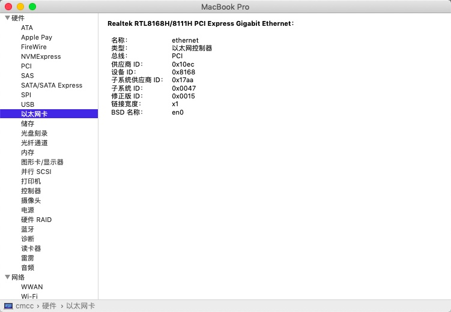
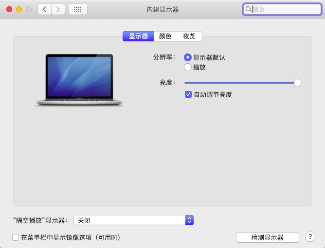
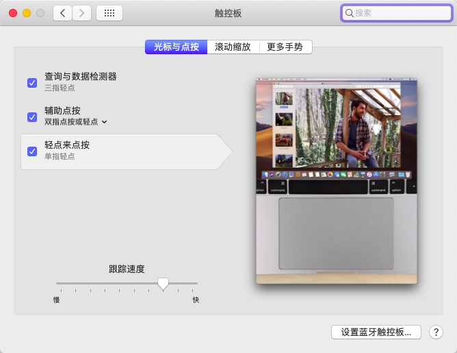

# xiaoxin700

## 电脑概览

| 说明     | 描述                                                        |
| -------- | ----------------------------------------------------------- |
| 操作系统 | Microsoft Windows 10 家庭中文版 (64位)                      |
| CPU      | (英特尔)Intel(R) Core(TM) i5-6300HQ CPU @ 2.30GHz(2304 MHz) |
| 主板     | 联想 Lenovo XiaoXin 700-15ISK                               |
| 内存     | 8.00 GB ( 2133 MHz)                                         |
| 显卡     | NVIDIA GeForce GTX 950M                                     |
| 显示器   | 京东方 BOE HF 32位真彩色 60Hz                               |
| 声卡     | Realtek High Definition Audio                               |
| 网卡     | Intel(R) Dual Band Wireless-AC 3165                         |

## 11.0.1

- 一直提示更新，决定更新到Big Sur
- 无线网卡AC 3165使用 airportitlwm.kext(BigSur版),内含itlwm.kext全固件版本
- 在10.15.7的EFI的基础上更新了Opencore 、Plugins 、Driver and Config.plist
- 使用11.22(0ccb21b) 更新的有线网卡驱动后以太网无连接，我的提交版本已回退(-new.kext为保留的新版本)，有些机器可能没有这个问题可以尝试使用新版的驱动。

## 10.15.7 体验

- 体验同10.14.6，可以睡眠唤醒
- 支持驱动自带无线网卡AC 3165 (itlwm.kext)
- 使用itlwm.kext 的用户请下载HeliPort，具体如何使用请参考互联网。

## 10.14.6使用体验

> 使用体验：

- 运行流畅，无线网卡驱动不了（可以使用蓝牙共享网络，USB 共享网络）
- 使用 USB 共享网络需要安装软件，请查看工具目录
- 触摸板的没有苹果说的那么多手势，只有基本的移动，点击
- 蓝牙无法关闭
- 独立显卡的问题我不是很懂（可能我不使用需要显卡的软件吧）
- 除了以上，暂时没有发现啥问题。
### 使用说明

- 安装好后，使用工具中的 clover configurator 工具，选择 Mount EFI
- 进行`mount partition` 将原来的 EFI 进行删除，使用下载的进行替换。

### 图片展示
- 
- 
- 
- 
- 
- 
- 

## 鸣谢

- 本仓库的内容来源于网上搜集,搭建系统镜像来源于[黑果小兵的部落阁](https://blog.daliansky.net/)
- OC部分的EFI来自于 [ShiShuMo/Hackintosh-LENOVO-xiaoxin700-ideapad700-Opencore-OC](https://github.com/ShiShuMo/Hackintosh-LENOVO-xiaoxin700-ideapad700-Opencore-OC)

---

- 感谢 [Acidanthera](https://github.com/acidanthera) 提供 [AppleALC](https://github.com/acidanthera/AppleALC)，[AppleSupportPkg](https://github.com/acidanthera/AppleSupportPkg)，[HibernationFixup](https://github.com/acidanthera/HibernationFixup)，[Lilu](https://github.com/acidanthera/Lilu)，[NVMeFix](https://github.com/acidanthera/NVMeFix)，[OpenCorePkg](https://github.com/acidanthera/OpenCorePkg)，[VirtualSMC](https://github.com/acidanthera/VirtualSMC)，[VoodooInput](https://github.com/acidanthera/VoodooInput)，[VoodooPS2](https://github.com/acidanthera/VoodooPS2) 和 [WhateverGreen](https://github.com/acidanthera/WhateverGreen)。
- 感谢 [apianti](https://sourceforge.net/u/apianti)，[blackosx](https://sourceforge.net/u/blackosx)，[blusseau](https://sourceforge.net/u/blusseau)，[dmazar](https://sourceforge.net/u/dmazar) 和 [slice2009](https://sourceforge.net/u/slice2009) 提供 [Clover](https://github.com/CloverHackyColor/CloverBootloader)。
- 感谢 [daliansky](https://github.com/daliansky) 提供 [OC-little](https://github.com/daliansky/OC-little)。
- 感谢 [FallenChromium](https://github.com/FallenChromium)，[jackxuechen](https://github.com/jackxuechen)，[Javmain](https://github.com/javmain)，[johnnync13](https://github.com/johnnync13)，[Menchen](https://github.com/Menchen)，[Pasi-Studio](https://github.com/Pasi-Studio)，[qeeqez](https://github.com/qeeqez) 和 [Bat.bat](https://github.com/williambj1) 的宝贵建议。
- 感谢 [OpenIntelWireless](https://github.com/OpenIntelWireless) 提供 [IntelBluetoothFirmware](https://github.com/OpenIntelWireless/IntelBluetoothFirmware)。
- 感谢 [RehabMan](https://github.com/RehabMan) 提供 [EAPD-Codec-Commander](https://github.com/RehabMan/EAPD-Codec-Commander)，[EFICheckDisabler](https://github.com/RehabMan/hack-tools/tree/master/kexts/EFICheckDisabler.kext)，[OS-X-Clover-Laptop-Config](https://github.com/RehabMan/OS-X-Clover-Laptop-Config)，[OS-X-Null-Ethernet](https://github.com/RehabMan/OS-X-Null-Ethernet) 和 [SATA-unsupported](https://github.com/RehabMan/hack-tools/tree/master/kexts/SATA-unsupported.kext)。

